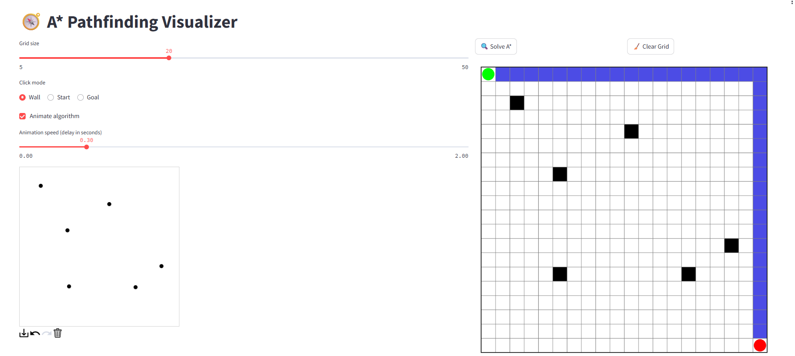

# A* Pathfinding Visualizer


## 📋 Overview

A* Pathfinding Visualizer is an interactive web application that demonstrates how the A* algorithm searches for the optimal path between two points while avoiding obstacles. This educational tool allows users to create custom maze scenarios and visualize the algorithm's decision-making process in real time.



## ✨ Features

- **Interactive Grid Canvas**: Draw walls, set start and goal points with simple clicks
- **Real-time Visualization**: Watch the A* algorithm's exploration process step by step
- **Animation Controls**: Adjust speed and toggle animation for better understanding
- **Clear Visual Indicators**:
  - 🟢 Start point
  - 🔴 Goal point
  - ⬛ Walls/obstacles
  - 🟩 Open set (nodes being considered)
  - 🟥 Closed set (nodes already evaluated)
  - 🟦 Path found

## 🧠 Understanding A* Algorithm

The A* (pronounced "A-star") algorithm is widely used in pathfinding and graph traversal. It's valued for its performance and accuracy and uses a best-first search approach.

The algorithm uses a heuristic function to determine which paths to explore:

- **F-score = G-score + H-score**
  - **G-score**: The cost from the start node to the current node
  - **H-score**: The estimated cost from the current node to the goal (Manhattan distance in this implementation)

A* always expands the node with the lowest F-score, ensuring it finds the optimal path.

## 🚀 Getting Started

### Prerequisites

- Python 3.7+
- pip (Python package installer)

### Installation

1. Clone the repository:
   ```bash
   git clone https://github.com/yourusername/astar-pathfinding-visualizer.git
   cd astar-pathfinding-visualizer
   ```

2. Install required packages:
   ```bash
   pip install -r requirements.txt
   ```

### Running the Application

1. Launch the Streamlit app:
   ```bash
   streamlit run app.py
   ```

2. Open your web browser and navigate to the provided URL (typically http://localhost:8501)

## 📝 How to Use

1. **Set Grid Size**: Use the slider to adjust the dimensions of the grid
2. **Draw Walls**: Select "Wall" mode and click/drag on the canvas to place obstacles
3. **Set Start/Goal**: Select respective modes and click to place the start and goal points
4. **Configure Animation**: Toggle animation and adjust speed if desired
5. **Run Algorithm**: Click "Solve A*" to start the pathfinding process
6. **Reset**: Use "Clear Grid" to start over with a clean grid

## 💡 Educational Value

This visualizer helps demonstrate important concepts in computer science:
- Heuristic-based search algorithms
- Priority queues and dynamic programming
- Graph traversal techniques
- Optimization problems

It's an excellent tool for:
- Computer science students learning algorithms
- Teachers demonstrating pathfinding concepts
- Anyone interested in understanding how navigation systems work

## 📚 Technical Implementation

- **Frontend and Backend**: Built with Streamlit for seamless Python-based web applications
- **Visualization**: Uses Matplotlib for rendering the grid and algorithm states
- **Algorithm**: Pure Python implementation of A* with animation capabilities
- **Canvas Interaction**: Leverages streamlit-drawable-canvas for mouse input

## 📄 License

This project is licensed under the MIT License - see the LICENSE file for details.

## 🙏 Acknowledgments

- Inspired by various pathfinding visualizers that help make complex algorithms accessible
- Built with [Streamlit](https://streamlit.io/) - an amazing framework for data applications

---

Made with ❤️ for algorithm enthusiasts and learners everywhere
